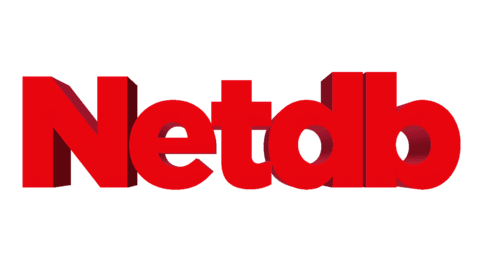

 

  

  <h3 align="center">Netdb</h3>

  

    An unofficial Netflix API
     
    <a href="https://netdb.at/docs"><strong>Explore the docs »</strong></a>
     
     
    <a href="https://netdb.at">View Page</a>
    ·
    <a href="https://github.com/YannickFuereder/Netdb.at/issues">Report Bug</a>
    ·
    <a href="https://github.com/YannickFuereder/Netdb.at/issues">Request Feature</a>
  

<!-- TABLE OF CONTENTS -->

  
Table of Contents

  <ol>
    <li>
      <a href="#about-the-project">About The Project</a>
      <ul>
        <li><a href="#built-with">Built With</a></li>
      </ul>
    </li>
    <li><a href="#roadmap">Roadmap</a></li>
    <li><a href="#contributing">Contributing</a></li>
    <li><a href="#license">License</a></li>
    <li><a href="#contact">Contact</a></li>
    <li><a href="#acknowledgements">Acknowledgements</a></li>
  </ol>

<!-- ABOUT THE PROJECT -->
## About The Project

Netdb is an unofficial Netflix API.

### Built With
* [Javascript](https://www.javascript.com)
* Html,Css

<!-- ROADMAP -->
## Roadmap

See the [open issues](https://github.com/Netflix-Database/Netdb/issues) for a list of proposed features (and known issues).

<!-- LICENSE -->
## License

Distributed under the MIT License. See `LICENSE` for more information.

<!-- CONTACT -->
## Contact

support@netdb.ga

Project Link: [https://github.com/Netflix-Database/Netdb](https://github.com/Netflix-Database/Netdb)

<!-- ACKNOWLEDGEMENTS -->
## Acknowledgements
